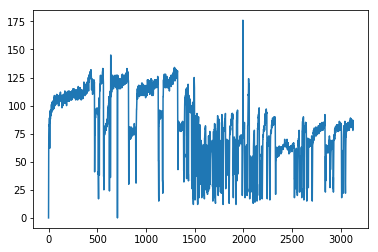

# GoldenCheeta Open Data Python library

This is the official Python library to work with the data from the GoldenCheetah Open Data project.
This data is available on the Open Science Framework ([https://osf.io/6hfpz](https://osf.io/6hfpz)) and on AWS S3 ([https://goldencheetah-opendata.s3.amazonaws.com/](https://goldencheetah-opendata.s3.amazonaws.com/)).
For this library AWS S3 used.

## Installation
```
pipenv install goldencheetah-opendata
```
or
```
pip install goldencheetah-opendata
```

## Usage

```python
from opendata import OpenData


od = OpenData()
```


The library makes a clear distinction between working with remote data (AWS S3) and data that you have downloaded locally. Working with remote data makes it possible to work with data in e.g. an hosted Jupyter notebook or to play with data that you have not downloaded yet. Bare in mind that working with the remote data has a performance penalty: downloading the data is orders of magnitude slower that accessing data from disk. If you expect to use the data more often we advise you to store the data to disk (read on to see how to do that). As an added bonus you will save us some network traffic costs on our next AWS bill, yey!

By default, when you store data locally the data is stored in an `opendatastorage` directory in your home directory (`~/opendatastorage`).
In general:
- MacOS: `/Users/<username>/opendatastorage`
- Linux: `/home/<username>/opendatastorage`
- Windows: `C:\Users\<username>\opendatastorage`

You can overwrite this location by putting a file `opendata.ini` in your working directory (generally the directory from where you execute Python) with this content:
```
[Storage]
local_storage_path = <path to your desired location>
```


### Working with remote data storage
List all remote athletes.
```python
for athlete in od.remote_athletes():
    # do something
    pass
```
`od.remote_athletes()` returns a generator of `RemoteAthlete` models. It is important to note that this will only do a (i.e. 1) call to our remote storage to get a list of the available athletes without actually downloading the data. Only when you access the `metadata` attribute or call `athlete.activities()` or `athlete.get_activities()` the data will be downloaded.

To get a specific athlete:
```python
athlete = od.get_remote_athlete('0031326c-e796-4f35-8f25-d3937edca90f')
```

To store this athlete athlete locally:
```python
athlete.store_locally()
```

To store only the metadata:
```python
athlete.store_locally(data=False)
```
the rest of the data could always be retrieved later:
```python
from opendata.models import LocalAthlete
local_athlete = LocalAthlete(athlete.id)
local_athlete.download_remote_data()
```

### Working with local data storage
List all local athletes.
```python
for athlete in od.local_athletes():
    # do something
    pass
```
`od.local_athletes()` returns a generator of `LocalAthlete` models. Here again, no data is actually loaded (from disk in this case) untill you access the `metadata` attribute or call `athlete.activities()` or `athlete.get_activity()`.

To check which athletes are available that you do not have downloaded locally:
```python
missing_athletes = list(od.missing_athletes())
print(len(missing_athletes))
>> 168
```

To get a specific athlete:
```python
athlete = od.get_local_athlete('0031326c-e796-4f35-8f25-d3937edca90f')
```

### General usage
```python
athlete.metadata['ATHLETE']
>> {'gender': 'M', 'yob': '2062', 'id': '{0031326c-e796-4f35-8f25-d3937edca90f}'}
```


To get all activities for an athlete:
```python
activities = athlete.activities()
for activity in activities:
    # do some calculation on the data
    pass
```

As you might have guessed, `athlete.activities()` returns a generator of `Activity` models, so to have all activities as a list:
```python
activities = list(athlete.activities())
```

This way you can access single activities by index:
```python
activity = actitivies[99]
```

To get a specific activity for an athlete by activity_id:
```python
activity = athlete.get_activity('2018_03_17_09_29_27.csv')
```


The activity data for an activity is available as a Pandas DataFrame in the `data` attribute. Once again, for memory usage and performance reasons, this data is only loaded in memory once you access it.
```python
activity.data.power.plot()
```




```python
activity.metadata['sport']
>> 'Bike'
```

```python
athlete.metadata['ATHLETE']
>> {'gender': 'M', 'yob': '2062', 'id': '{0031326c-e796-4f35-8f25-d3937edca90f}'}
```


```python
activities = list(athlete.activities())
activities[99].metadata
 >> {'date': '2017/10/21 12:01:56 UTC',
     'data': 'TDS-H--AGL-----',
     'sport': 'Bike',
     'METRICS': {'ride_count': '1.00000',
      'workout_time': '1077.00000',
      'time_riding': '1072.00000',
      'total_distance': '6.69220',
      'climb_rating': ['0.08019', '1.00000'],
      'athlete_weight': '81.00000',
      'elevation_gain': '23.16500',
      'elevation_loss': '9.14400',
      'average_speed': '22.47381',
      'average_hr': ['123.17920', '1077.00000'],
      'average_ct': ['37.15861', '1077.00000'],
      'heartbeats': '2211.06667',
      'average_temp': '-255.00000',
      'max_heartrate': '134.00000',
      'min_heartrate': '100.00000',
        ...
    }}
```
